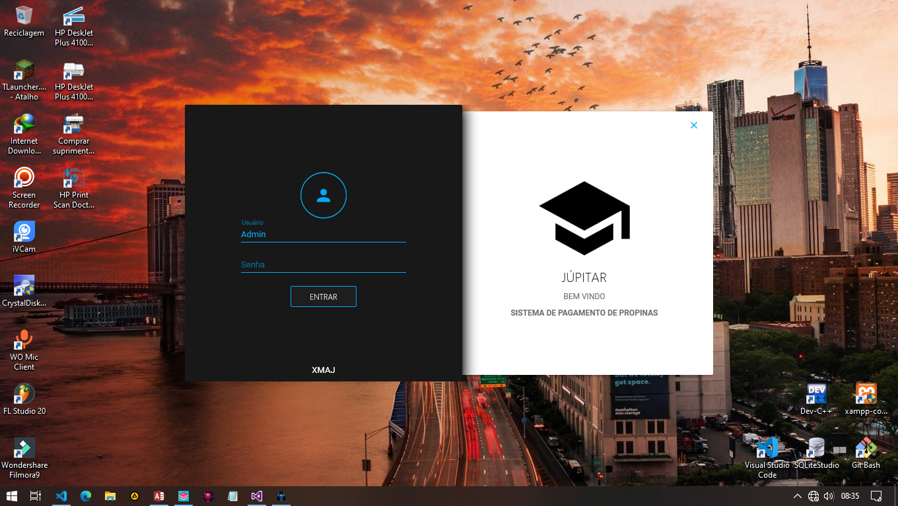
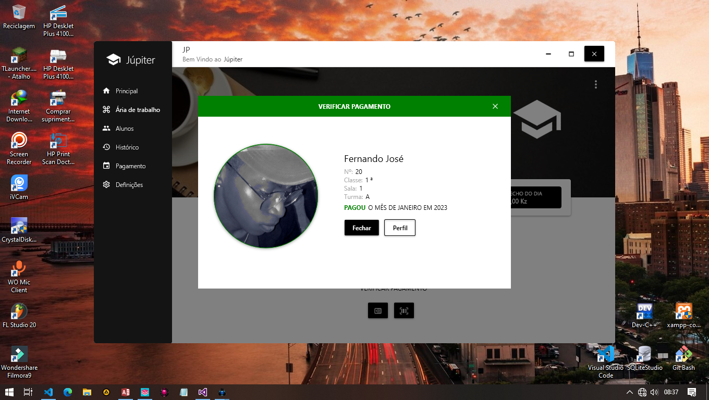
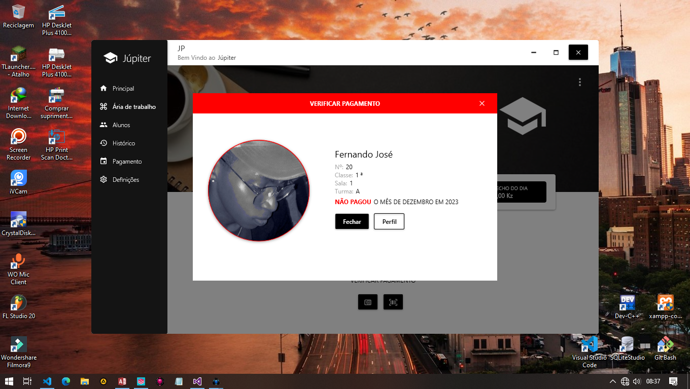
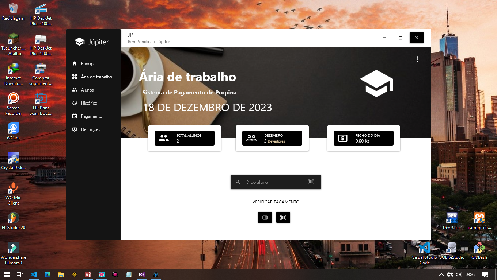
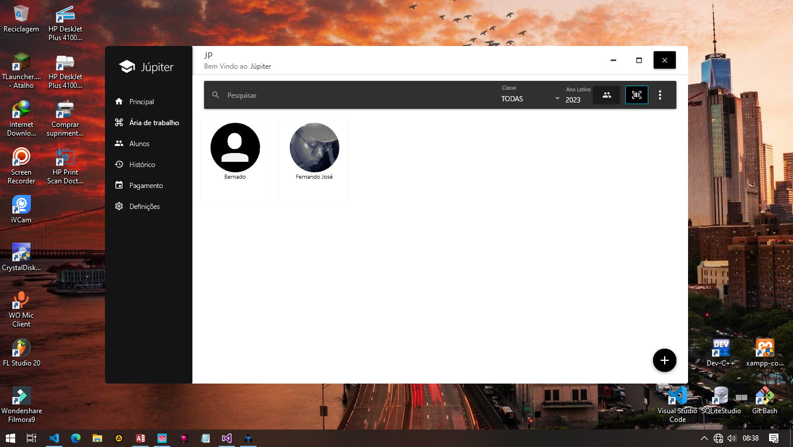
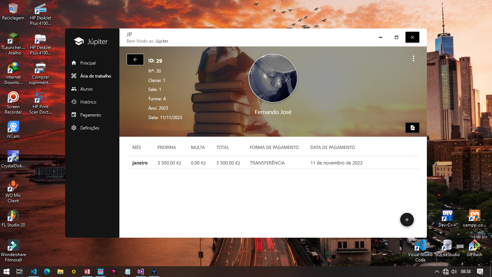
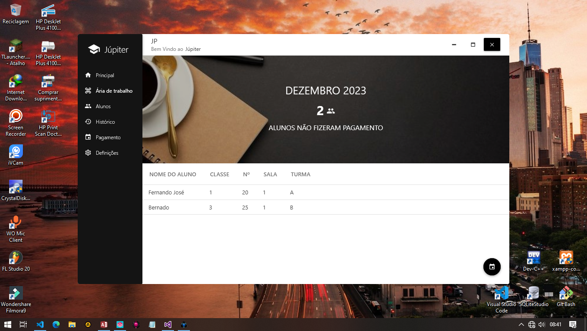

# Júpiter - Sistema de Pagamentos de Propina

## Descrição

O Júpiter é um sistema de pagamentos de propina desenvolvido em C# com tecnologias como WPF e Access. Projetado para proporcionar uma gestão eficiente de pagamentos escolares, oferece uma experiência completa para administradores educacionais.

## Inicialização do Programa

1. Inicie o programa como administrador.
2. Insira a senha padrão: .....😜 (minúsculas).

## Área Principal

Ao entrar na área principal, clique em "Área de Trabalho" para visualizar estatísticas cruciais, como o total de alunos, débitos do mês e fechamento diário.

## Verificação de Alunos

- O sistema também oferece a opção de verificar se o aluno pagou um mês específico.

   

   - Caso não tenha pago:

   

   - Acesse o perfil do aluno para mais detalhes.

## Área de Trabalho

- Fornece estatísticas essenciais, como total de alunos, débitos do mês e fechamento do dia.

- Após passar o cartão do aluno, o sistema exibirá suas informações.
- Utilize o campo de pesquisa para encontrar alunos rapidamente por ID.

## Alunos

- Visualize a lista de alunos e pesquise por nome, ID, classe ou ano letivo.
- Adicione novos alunos e acesse o perfil para edições.

## Perfil do Aluno

- Veja os meses pagos pelo aluno e adicione novos pagamentos.

- Gere cartões, imprima códigos de barras e adicione a um novo ano letivo.

- Adicione um novo pagamento, escolha o mês, a forma de pagamento e adicione detalhes adicionais.

- Gere recibos e exporte para PDF.

## Histórico do Dia

- Detalhes do total de pagamentos feitos diariamente.

## Pagamentos

- Visualize alunos em débito no mês atual.

- Verifique quem pagou ou não um determinado mês.

## Detalhes Adicionais

- Acesse o histórico detalhado dos pagamentos em uma data específica.

## Definições

- Altere a senha de acesso nas configurações.

Este guia oferece uma visão detalhada do sistema Júpiter. Consulte a documentação completa no diretório do projeto para informações mais abrangentes.
